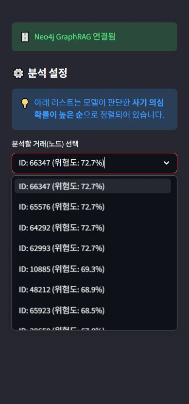
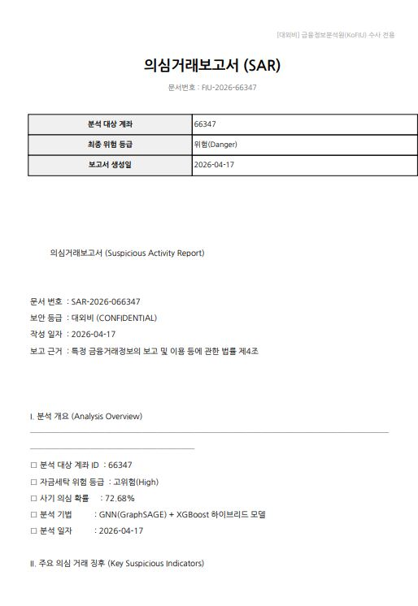

<div align="center">

# 🕵️ GNN + XGBoost 하이브리드 자금세탁 탐지 시스템

**그래프 신경망 기반 AML(Anti-Money Laundering) 탐지 · SHAP 설명 · LangGraph + Hybrid RAG SAR 자동 생성**

실제 자금세탁 유형 28종이 담긴 **SAML-D** 데이터에서 GraphSAGE와 XGBoost를 결합해 의심 계좌를 찾아내고,
KoFIU 법령 RAG를 기반으로 의심거래보고서(SAR)를 Groq LLM이 실시간 스트리밍으로 생성하는 End-to-End 시스템입니다.

[](https://github.com/namjun97/AML_project/actions/workflows/ci.yml)


[](https://huggingface.co/spaces/Vartyor/aml-project)

</div>

---

## 📑 목차

- [왜 이 프로젝트인가](#-왜-이-프로젝트인가)
- [모델 성능 & 검증](#-모델-성능--검증)
- [주요 기능](#-주요-기능)
- [시스템 아키텍처](#-시스템-아키텍처)
- [LangGraph SAR 파이프라인](#-langgraph-sar-파이프라인)
- [FastAPI 백엔드 & OpenWebUI](#-fastapi-백엔드--openwebui)
- [LangSmith 모니터링](#-langsmith-모니터링)
- [기술 스택](#️-기술-스택)
- [빠른 시작](#-빠른-시작)
- [프로젝트 구조](#-프로젝트-구조)
- [핵심 트러블슈팅](#-핵심-트러블슈팅)
- [로드맵](#-로드맵)
- [작성자](#-작성자)

---

## 💡 왜 이 프로젝트인가

자금세탁은 **단일 계좌의 이상 거래**가 아니라 **여러 계좌가 얽힌 네트워크 패턴**(레이어링, 분산 송금, 합치기 등)으로 발생합니다. 전통적인 룰 기반 · 단일 ML 모델은 계좌 단위 피처만 보기 때문에 이러한 구조를 놓치기 쉽습니다.

이 프로젝트는 세 가지 문제를 하나의 파이프라인으로 해결합니다.

| 금융 도메인 Pain Point | 해결 접근 |
|---|---|
| **탐지 정확도** — 계좌 네트워크 패턴이 단일 계좌 피처로 포착되지 않음 | **GraphSAGE(GNN) + XGBoost 하이브리드** (75차원 입력) |
| **설명 책임** — 금융 규제상 "왜 의심스러운가"를 근거로 제시해야 함 | **SHAP(TreeSHAP)** + 검증 가능한 모티프 피처/GNN 임베딩 기여도 |
| **보고 부담** — 의심거래보고서(SAR) 수작업 생성에 긴 시간 소요 | **Groq LLM + KoFIU 법령 Hybrid RAG + LangGraph**로 자동 생성 |

### 데이터셋 선택: PaySim → SAML-D (근거 신뢰성 확보)

초기에는 PaySim을 사용했으나, **자금세탁 네트워크가 구조적으로 없다**는 점을 데이터 분석으로 발견했습니다.
PaySim은 907만 계좌의 **94.8%가 거래 1회**, 경유 계좌 0.02%로 GNN이 학습할 위상 자체가 없어 모델 점수가
임베딩 근접성에만 의존(정상 계좌에 99% 부여)했습니다.

→ 실제 세탁 유형(Structuring, Smurfing, Layered Fan-In/Out, Bipartite, Deposit-Send 등) 28종과
**계좌 90%가 3회 이상 거래·경유 10.5%의 진짜 네트워크**를 담은 **[SAML-D](https://www.kaggle.com/datasets/berkanoztas/synthetic-transaction-monitoring-dataset-aml)** (950만 거래, 85.5만 계좌)로 전환해 GNN 사용을 정당화했습니다.

---

## 📊 모델 성능 & 검증

SAML-D 서브그래프(141,722 계좌 / 149,464 거래, 세탁 5.58%)에서 학습한 하이브리드 모델 성능입니다.

| 지표 | 값 |
|---|---|
| **Test AUC** | **0.989** |
| **Test AP (PR-AUC)** | **0.915** |
| **고확신 정밀도** (prob ≥ 0.99) | **98.3%** |
| 검증 가능한 모티프 변별력 (lift) | 팬아웃 ×7.6 · 경유 ×4.0 · 역외 ×4.8 · 환치기 ×5.0 |

### Ablation — "왜 GNN인가" (규칙 vs 학습)

동일 split·동일 XGBoost 하이퍼파라미터로 **피처셋만** 바꿔 비교했습니다. 불균형 데이터(세탁 5.58%)에서는
AUC가 부풀려지므로 **AP(PR-AUC)가 핵심 지표**입니다.

| 피처셋 | 차원 | Test AUC | **Test AP** |
|---|---|---|---|
| 모티프 11개만 *(규칙으로 쓸 수 있는 상한)* | 11 | 0.947 | **0.757** |
| GNN 임베딩만 | 64 | 0.988 | 0.908 |
| **하이브리드 (모티프 + 임베딩)** | 75 | **0.989** | **0.915** |

> 사람이 규칙으로 쓸 수 있는 모티프 11개를 XGBoost로 **최적 학습해도 AP 0.76이 상한**입니다(손코딩 규칙은
> 더 낮음). 여기에 다중 홉 거래망을 학습한 GNN 임베딩을 더하면 **AP 0.92** — 같은 재현율에서 오탐이
> 크게 줄어듭니다. 위상 구조는 if문으로 환원되지 않으므로, 이 격차가 GNN을 쓰는 근거입니다.

회귀 테스트(`tests/test_inference_pipeline.py`)가 **Test AUC > 0.9를 강제**해 추론 정합성을 영구 보장합니다.

---

## 🖥️ 주요 기능

### 1. 위험도 정렬 사이드바 — 의심 계좌 즉시 접근

<p align="center">
  
</p>

XGBoost 사기 확률 기준으로 위험 계좌를 내림차순 정렬(상위 watchlist)합니다. 확률은 100% 단정을 피해
99.9% 상한 + **위험 등급(고위험/위험/주의/낮음)**으로 함께 표기합니다.

---

### 2. 사기 확률 점수 & 위험 등급 카드

<p align="center">
  
</p>

노드 ID · 자금세탁 의심도(%) · 위험 등급을 메트릭 카드로 제시합니다.

---

### 3. SHAP 기여도 분석 — "왜 의심스러운가"

<p align="center">
  
</p>

**Waterfall 차트**로 각 피처가 판정에 얼마나 기여했는지 시각화합니다. XGBoost 3.x의 `base_score`
직렬화 버그를 우회하기 위해 **네이티브 `pred_contribs`(동일 TreeSHAP)**를 사용하며, GNN 임베딩
기여도까지 해석 대상에 포함해 **네트워크 구조 기여도**를 수치로 확인할 수 있습니다.

---

### 4. 자금 흐름 네트워크 시각화 — 이중 레이어

<p align="center">
  
</p>

pyvis 기반 이중 레이어 시각화:

- **실선** — 실제 거래 엣지(BFS 2-hop). 방향·금액과 함께 **자금세탁 확정 거래는 색으로 구분**, 역외·통화 불일치 정보를 툴팁으로 표시
- **점선** — GNN 임베딩 코사인 KNN 기반 **패턴 유사 계좌**. 직접 거래가 없어도 같은 세탁 패턴에 속하는 계좌를 함께 탐지

---

### 5. SAR 보고서 AI 실시간 생성 — 스트리밍 & LangGraph

<p align="center">
  
</p>

두 가지 모드로 SAR을 생성합니다.

- **스트리밍 모드** — Groq `llama-3.1-8b-instant` Streaming API로 토큰 단위 실시간 출력
- **LangGraph 모드** — 5개 노드 파이프라인(classify → retrieve → integrate → generate → validate)으로 실행, **법령 근거 포함 여부 자동 검증** + LangSmith 피드백 기록

KoFIU 자금세탁방지 업무지침 등을 ChromaDB에서 검색한 컨텍스트를 LLM 프롬프트에 주입하여 **법적 근거가 포함된** SAR을 만듭니다.

- 섹션 I (분석 개요) — Python 고정 양식
- 섹션 II / III / IV — LLM 생성 (`##II## … ##II_END##` 마커 구조)
- 섹션 V — Neo4j GraphRAG 결과 직접 삽입(계좌 위험 프로파일·직접 연결 세탁 계좌·팬아웃 지표 등)

---

### 6. SAR TXT 다운로드

<p align="center">
  
</p>

생성된 SAR을 `SAR-{year}-{node_id:06d}.txt` 형식으로 즉시 다운로드할 수 있습니다. 매 생성마다 동일한 문서 구조가 보장되어(파싱 안정화 메커니즘) 외부 워크플로에 그대로 연결 가능합니다.

---

### 7. 모델 · RAG 산출물 관리

<p align="center">
  
</p>

학습된 GNN(`model/saml_gnn.pth`) · XGBoost(`model/saml_fraud_model.pkl`) · ChromaDB 벡터스토어(`chroma_db/`)가 모두 프로젝트 내부에 포함되어 있어 **추가 학습 없이 즉시 추론**이 가능합니다.

---

## 🧭 시스템 아키텍처

```
┌──────────────────────────────────────────────────────────────┐
│  ① DATA LAYER — SAML-D 전처리 & 그래프 구성                     │
│     세탁 거래 전체 + 정상 샘플 → 계좌 노드(11D 모티프) + 거래 엣지 │
│     하나의 df_sampled 에서 일관 생성(node_idx↔계좌 정합, P0)     │
└──────────────────────────────┬───────────────────────────────┘
                               ▼
┌──────────────────────────────────────────────────────────────┐
│  ② GRAPH LEARNING — GraphSAGE 3층 (PyTorch Geometric)          │
│     SAGEConv × 3 + Dropout                                    │
│     11D → 128 → 128 → 64D 노드 임베딩                           │
└──────────────────────────────┬───────────────────────────────┘
                               ▼
┌──────────────────────────────────────────────────────────────┐
│  ③ CLASSIFICATION + EXPLANATION — XGBoost + SHAP                │
│     입력: 원본 모티프 11D + GNN 임베딩 64D = 75D                 │
│     StandardScaler(train fit) · 네이티브 TreeSHAP(pred_contribs)│
└──────────────────────────────┬───────────────────────────────┘
                               ▼
┌──────────────────────────────────────────────────────────────┐
│  ④ KNOWLEDGE LAYER — Text RAG + GraphRAG                        │
│     LangChain + ChromaDB (PersistentClient)                    │
│       └ KoFIU 지침 → sentence-transformers 임베딩               │
│     Neo4j Cypher Q0~Q4 → 계좌 프로파일 · 세탁 경로 · 허브 지표    │
└──────────────────────────────┬───────────────────────────────┘
                               ▼
┌──────────────────────────────────────────────────────────────┐
│  ⑤ SAR PIPELINE — LangGraph 5-Node Workflow                     │
│     [classify] →(조건부 분기)→ [retrieve | retrieve_vector]     │
│                → [integrate] → [generate] → [validate]         │
│     LangSmith로 노드별 추적 + law_reference_check 피드백          │
└──────────────────────────────┬───────────────────────────────┘
                               ▼
┌──────────────────────────────────────────────────────────────┐
│  ⑥ SERVING LAYER — 하나의 백엔드, 두 프론트엔드                   │
│     Streamlit 대시보드 (분석) ──┐                               │
│                                ├── 탐지·SAR 로직 (공통)          │
│     FastAPI(app_api.py) ───────┘  REST + OpenAI 호환 /v1        │
│       └ OpenWebUI 채팅 프론트엔드 연동                            │
└──────────────────────────────────────────────────────────────┘
```

### 설계 원칙

- **SRP + 의존성 주입(DI)** — `ContextBuilder`, `ReportRunner` 등 각 클래스는 단일 책임을 가지며 외부에서 주입된 의존 객체를 사용
- **추론 정합성** — 학습/서빙 전처리(피처 순서 `[원본, 임베딩]` + StandardScaler)를 단일 헬퍼로 통일하고 회귀 테스트(AUC>0.9)로 고정
- **Graceful Degradation** — Neo4j 연결 실패 또는 RAG 초기화 실패 시에도 텍스트 RAG · GNN 파이프라인은 정상 동작
- **관찰 가능성** — LangSmith로 LangGraph 노드별 실행 + 법령 인용 검증 피드백 추적

---

## 🔗 LangGraph SAR 파이프라인

### LangChain → LangGraph 전환 이유

기존 단순 체인 방식에서는 ① 단계 격리·노드 단위 추적이 어렵고, ② 생성된 SAR에 법령 근거가 실제로
포함됐는지 검증하는 단계가 없었습니다. `State + Node` 구조로 전환하면서 각 단계를 독립적으로
테스트·모니터링하고, `validate` 노드에서 법령 키워드 포함 여부를 자동 검증합니다.

### 노드 구조 (조건부 분기)

```
[START] → [classify]
              │  GNN 위험 신호 有 → "network"  → [retrieve]         (Hybrid: Vector + Neo4j)
              └  그 외          → "standard" → [retrieve_vector]   (Vector 전용, Neo4j 생략)
                                                     ↓
                          [integrate] (유사도 정렬 앙상블) → [generate] (Groq LLM)
                                                     ↓
                          [validate] (법령 키워드 검증 + LangSmith 피드백) → [END]
```

- **조건부 엣지** — GNN 임베딩이 위험 신호일 때만 거래 네트워크 구조(Neo4j)가 핵심 근거이므로 Hybrid 경로로 분기. standard 경로는 Neo4j(AuraDB 최대 30초 지연)를 건너뜀. 공고의 "질의 분류 → 전문 노드" 구조의 축소판.
- **단일 책임 컨텍스트 조립** — `integrate`가 RAG 검색 결과를 유사도 내림차순으로 정렬해 LLM 프롬프트용 컨텍스트를 단독 생성(프롬프트가 상위 N자만 사용하므로 고유사도 법령이 잘림에서 살아남음).

### State 스키마

```python
class AMLState(TypedDict):
    sar_payload:   dict   # build_sar_payload() 결과
    sar_json_str:  str    # JSON 직렬화 문자열
    node_idx:      int    # 분석 대상 노드 인덱스
    query_type:    str    # "network" | "standard"
    rag_scores:    list   # [{text, source, score}, ...] 유사도 포함 원본 (retrieve)
    rag_context:   str    # integrate 가 정렬 후 생성 (LLM 프롬프트용)
    graph_context: str    # Neo4j GraphRAG 결과
    sar_draft:     str    # LLM 생성 SAR 초안
    final_report:  str    # 검증·조립 완성 보고서
    is_valid:      bool   # 법령 근거 포함 여부
```

### 사용 예시

```python
from reporters.sar_graph import build_sar_graph

graph = build_sar_graph(context_builder, report_runner)
result = graph.invoke({
    "sar_payload":  sar_payload,
    "sar_json_str": sar_json_str,
    "node_idx":     node_idx,
})
print(result["final_report"])
print("법령 근거 포함:", result["is_valid"])   # True / False
print("질의 유형:", result["query_type"])       # "network" / "standard"
```

---

## 🔌 FastAPI 백엔드 & OpenWebUI

탐지·SAR 로직을 그대로 재사용하면서, Streamlit 일체형에서 **백엔드 서비스**(`app_api.py`)를 분리했습니다.
**하나의 FastAPI 백엔드가 성격이 다른 두 프론트엔드를 동시에 지원**합니다.

| 프론트엔드 | 성격 | 용도 | 연결 |
|---|---|---|---|
| **Streamlit 대시보드** | 분석 대시보드 | SHAP·네트워크 시각화로 시각적 조사 | 직접 |
| **OpenWebUI** | 대화형 채팅 | 계좌번호 입력 → SAR 즉시 생성 | OpenAI 호환 `/v1` |

```
REST (자체 통합용)
  GET  /health
  GET  /api/accounts/watchlist?limit=20   # 위험도 상위 계좌
  GET  /api/accounts/{node_idx}           # 단일 계좌 탐지 + SHAP 근거
  POST /api/sar/generate {node_idx}       # LangGraph 파이프라인 → SAR
OpenAI 호환 (OpenWebUI 프론트엔드 — 코드 0줄)
  GET  /v1/models
  POST /v1/chat/completions               # 메시지에서 계좌 id 파싱 → SAR 스트리밍(SSE)
```

```bash
# 백엔드 기동
uvicorn app_api:app --host 0.0.0.0 --port 8000

# OpenWebUI (Docker) — Base URL: http://host.docker.internal:8000/v1, 모델 'aml-sar'
docker run -d -p 3000:8080 --add-host=host.docker.internal:host-gateway \
  ghcr.io/open-webui/open-webui:main
```

---

## 📊 LangSmith 모니터링

LangSmith를 통해 LangChain RAG 체인과 LangGraph 노드 실행을 추적합니다.

### 설정

`.env` 파일에 아래 값을 추가하면 앱 시작 시 자동으로 추적이 활성화됩니다.

```bash
LANGCHAIN_TRACING_V2=true
LANGCHAIN_API_KEY=lsv2_pt_...          # smith.langchain.com 에서 발급
LANGCHAIN_PROJECT=AML-project
```

### 추적 대상

| 추적 항목 | 내용 |
|---|---|
| **LangGraph 노드** | classify / retrieve / integrate / generate / validate 각 단계 입출력 |
| **LLM 호출** | Groq llama-3.1 토큰 사용량 · 지연 시간 |
| **커스텀 피드백** | `law_reference_check` — LLM 초안의 법령 인용 여부를 score 0/1로 기록 |

> LangSmith API 키는 [smith.langchain.com](https://smith.langchain.com) → Settings → API Keys 에서 발급합니다.

---

## 🛠️ 기술 스택

**Graph & ML**  `PyTorch` · `PyTorch Geometric` · `GraphSAGE(SAGEConv)` · `XGBoost` · `SHAP` · `scikit-learn`
**LLM & RAG**  `LangChain 0.3.x` · `LangGraph 0.6.x` · `LangSmith` · `ChromaDB` · `Groq(llama-3.1)` · `sentence-transformers` · `Neo4j`
**Data & Viz**  `pandas` · `numpy` · `pyvis` · `matplotlib`
**Serving**  `Streamlit` · `FastAPI` · `uvicorn` · `OpenWebUI` · `Python 3.10` · `Docker`

---

## 🚀 빠른 시작

### 사전 요구사항

- Python 3.10
- [Groq API 키](https://console.groq.com) (무료, SAR 생성에 사용)
- (선택) Neo4j 5.x — GraphRAG 기능 사용 시
- (선택) [LangSmith API 키](https://smith.langchain.com) — 파이프라인 모니터링 시

### 설치 & 실행 (5분)

```bash
# 1) 저장소 클론
git clone https://github.com/namjun97/AML_project.git
cd AML_project

# 2) 가상환경
python -m venv .venv
.venv\Scripts\activate        # Windows
# source .venv/bin/activate   # macOS/Linux

# 3) 의존성 설치
pip install -r requirements.txt

# 4) 환경변수 설정
cp .env.example .env
# .env 파일을 열어 GROQ_API_KEY 등 실제 값 입력

# 5) 대시보드 실행
streamlit run app.py
# → http://localhost:8501
```

### (선택) FastAPI 백엔드 + OpenWebUI

```bash
uvicorn app_api:app --port 8000
docker run -d -p 3000:8080 --add-host=host.docker.internal:host-gateway \
  ghcr.io/open-webui/open-webui:main
# OpenWebUI(http://localhost:3000) → Connections → Base URL: http://host.docker.internal:8000/v1
```

### (선택) GraphRAG 활성화 — Neo4j AuraDB 연결

```bash
# .env 파일에 Neo4j 연결 정보 입력
NEO4J_URI=neo4j+s://<instance-id>.databases.neo4j.io
NEO4J_USERNAME=neo4j
NEO4J_PASSWORD=<password>

# SAML 그래프를 Neo4j 에 적재 (저장된 매핑 사용)
python tools/neo4j_load_saml.py --force
# → app.py 재실행 시 GraphRAG 자동 활성화 (미연결 시 Graceful Degradation)
```

### 재학습이 필요한 경우 (`dataset/SAML-D.csv` 필요)

```bash
python tools/build_saml_graph.py     # 1) 서브그래프 + 모티프 피처 + 매핑/스케일러
python tools/train_saml_model.py     # 2) GraphSAGE + 하이브리드 XGBoost 학습
python tools/neo4j_load_saml.py --force   # 3) Neo4j 적재
# → model/saml_gnn.pth, model/saml_fraud_model.pkl 갱신
```

---

## 📂 프로젝트 구조

```
AML_project/
├── app.py                          # Streamlit 대시보드 (분석 프론트엔드)
├── app_api.py                      # FastAPI 백엔드 (REST + OpenAI 호환 /v1)
├── neo4j_config.py                 # Neo4j 연결 설정
├── requirements.txt
├── .env.example                    # 환경변수 템플릿 (커밋용)
│
├── models/
│   └── embedding_extractor.py      # GraphSAGE 3층 + 추론 정합 헬퍼(피처순서·스케일러)
│
├── analysis/
│   ├── shap_analyzer.py            # 네이티브 TreeSHAP(pred_contribs) + 폴백
│   └── network_visualizer.py       # 실거래 + GNN KNN 이중 레이어 시각화
│
├── knowledge/
│   ├── rag_knowledge_base.py       # LangChain + ChromaDB(PersistentClient)
│   └── graph_rag.py                # Neo4j Cypher Q0~Q4 (GraphRAG)
│
├── reporters/
│   ├── ai_report_generator.py      # Groq 스트리밍 SAR + build_sar_payload
│   ├── sar_template.py             # 섹션 마커 파싱 + 고정 양식 조립
│   ├── context_builder.py          # Text RAG + GraphRAG 컨텍스트 (DI)
│   ├── report_runner.py            # 스트리밍 오케스트레이터
│   ├── sar_graph.py                # LangGraph 5-Node SAR 파이프라인
│   └── pdf_report_generator.py     # (선택) PDF 변환
│
├── loaders/
│   ├── resource_loader.py          # @st.cache_resource 모델 캐싱
│   └── knowledge_loader.py         # Graceful Degradation
│
├── tools/
│   ├── build_saml_graph.py         # SAML 서브그래프 + 모티프 피처 + 매핑
│   ├── train_saml_model.py         # GraphSAGE + 하이브리드 XGBoost 학습
│   └── neo4j_load_saml.py          # SAML 그래프 → Neo4j 적재
│
├── tests/                          # pytest 97개 (추론 AUC>0.9 강제 · SAR 파싱 · LangGraph 노드)
│
├── knowledge_base/                 # KoFIU 지침 원본 (PDF/TXT)
├── chroma_db/                      # ChromaDB 벡터스토어 (persistent)
│
└── model/
    ├── saml_gnn.pth                # 학습된 GraphSAGE 가중치
    ├── saml_fraud_model.pkl        # XGBoost + scaler + feature_names
    ├── saml_graph.pt               # 그래프(노드/엣지/마스크)
    └── saml_node_mapping.csv       # node_idx ↔ 계좌 ↔ 라벨 (P0 정합)
```

---

## 🔧 핵심 트러블슈팅

직접 디버깅하고 코드로 해결한 이슈들입니다.

| # | 문제 | 원인 | 해결책 |
|---|---|---|---|
| **TS-01** | 정상 계좌에도 사기 확률 99% (근거 신뢰 불가) | PaySim에 자금세탁 네트워크가 없음(계좌 94.8%가 거래 1회) | **SAML-D로 데이터셋 전면 교체** — 실제 세탁 유형/네트워크 확보, 모티프 lift 4~7배 회복 |
| **TS-02** | 서빙 Test AUC 0.34 (무작위 이하) | 학습/서빙 전처리 불일치 — 피처 순서 반전 + StandardScaler 누락 | 전처리를 **단일 헬퍼로 통일** + **AUC>0.9 강제 회귀 테스트** → AUC 0.989 |
| **TS-03** | SHAP `TreeExplainer` 예외 | XGBoost 3.x `base_score`가 `"[5E-1]"` 배열 문자열로 저장 | **네이티브 `booster.predict(pred_contribs=True)`**(동일 TreeSHAP)로 우회 |
| **TS-04** | SAR 조치 권고(IV)가 매번 "파싱 실패" | LLM이 `##IV_END##` 종료 마커를 생략(시작 마커만 사용) | `_extract_section`에 **종료 마커 없으면 다음 마커/EOS까지** 캡처하는 폴백 추가 |
| **TS-05** | Groq 413 (Request too large, TPM 6000 초과) | RAG/Graph 컨텍스트 + max_tokens 합이 한도 초과 | 컨텍스트 길이 제한(RAG 500/Graph 1200) + max_tokens 1800 + 429 재시도·백오프 |
| **TS-06** | SAR 출력 구조가 매번 달라짐 | LLM 비결정성 + 마커 마크다운 변형 | `temperature=0.1, seed=42` + `_normalize_markers()` + 고정 양식 조립 |
| **TS-07** | FastAPI 백엔드 startup 크래시 (exit 3) | cp949 콘솔에서 `print`의 em-dash(`—`) UnicodeEncodeError | stdout을 UTF-8로 재설정(`reconfigure`) |
| **TS-08** | `pip install` 무한 백트래킹 | LangChain 생태계 버전 제약 교차 충돌 | 의존성 교집합을 수동 계산해 `langchain-core==0.3.86`, `langsmith==0.3.45` 등 일관 핀 |
| **TS-09** | `requirements.txt` UnicodeDecodeError | Windows pip이 cp949로 읽다 UTF-8 멀티바이트(한글, `──`) 디코딩 실패 | 주석을 전부 ASCII 영문으로 교체 |

---

## 🗺️ 로드맵

- [x] **Phase 1** — PaySim 분석 → 네트워크 부재 발견 → **SAML-D로 전환**
- [x] **Phase 2** — SAML 서브그래프(모티프 11피처) + GraphSAGE + 하이브리드 XGBoost (AUC 0.989)
- [x] **Phase 3** — SHAP 설명 + LangChain/ChromaDB RAG + Groq 스트리밍 SAR
- [x] **Phase 4** — Neo4j GraphRAG(Q0~Q4) + SAR 템플릿/근거 품질 리팩토링
- [x] **Phase 5** — LangGraph 5-Node 파이프라인(조건부 분기) + LangSmith 모니터링
- [x] **Phase 6** — FastAPI 백엔드 + OpenAI 호환 엔드포인트(OpenWebUI 연동)
- [ ] **Phase 7** — 실시간 스트리밍 입력(Kafka 등) + 증분 학습 고려

---

## 🙋 작성자

**김남준**
데이터 분석 · AI 모델링에 관심을 둔 신입 개발자. 문제 정의부터 배포까지 전 과정을 1인이 책임지는 End-to-End 개발을 지향합니다.

- 🤗 [라이브 데모 (HuggingFace Spaces)](https://huggingface.co/spaces/Vartyor/aml-project)
- 📧 varute1997@gmail.com

---

## 📝 라이선스

본 저장소의 코드는 포트폴리오 목적으로 공개됩니다.
SAML-D 데이터셋 · KoFIU 지침 원본 문서는 각 원저작자의 라이선스를 따릅니다.

<div align="center">
<sub>Built with <b>Python</b> · <b>PyTorch Geometric</b> · <b>XGBoost</b> · <b>LangChain</b> · <b>LangGraph</b> · <b>LangSmith</b> · <b>Groq</b> · <b>Neo4j</b> · <b>FastAPI</b> · <b>Streamlit</b></sub>
</div>
